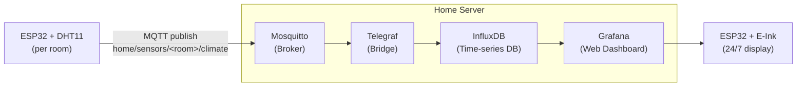
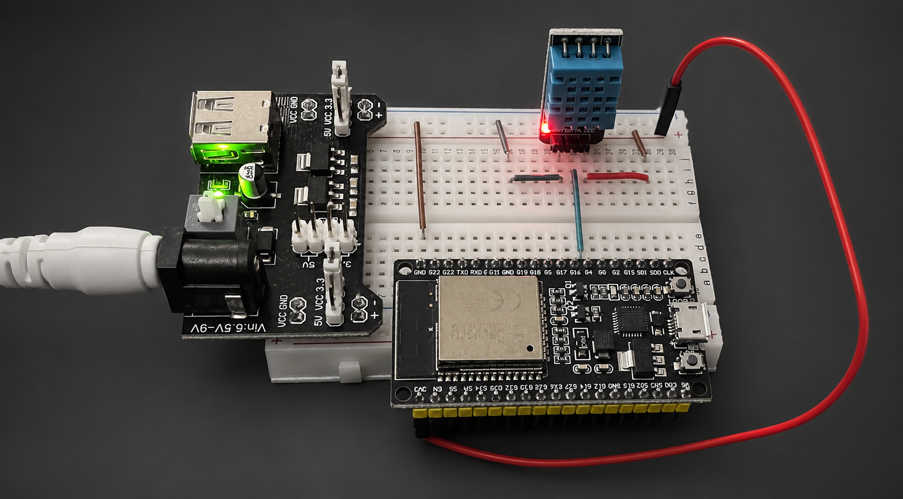
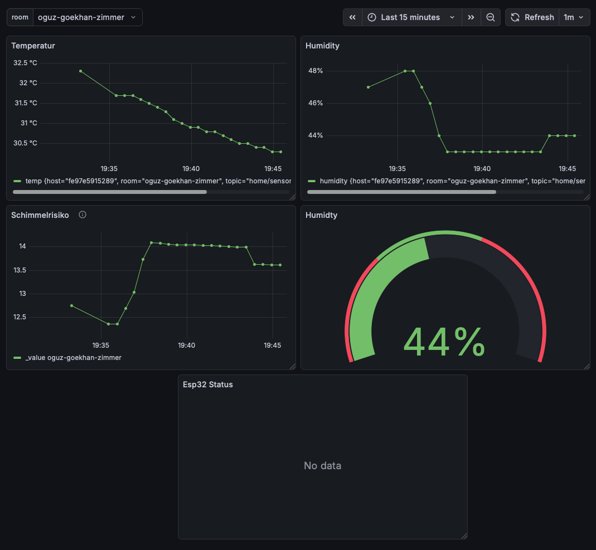

# Home Climate Monitor

My idea for this project: distributed sensor nodes → MQTT → time-series DB → Grafana. Plus a dedicated e-ink display that shows live room climate around the clock.

The broker and backend stack (Mosquitto, Telegraf, InfluxDB, Grafana) run on my self-hosted home server. Each ESP32 sensor node connects over WiFi and publishes data directly to it.

## Architecture



## Data Flow

1. Each sensor node reads temperature and humidity frequently and publishes a JSON payload:
   ```json
   { "room": "livingroom", "temp": 21.5, "humidity": 45.2 }
   ```
   to `home/sensors/livingroom/climate`.
2. **Mosquitto** receives the message and makes it available to any subscriber.
3. **Telegraf** subscribes to `home/sensors/+/climate` (wildcard across all rooms), parses the JSON, and writes each measurement into **InfluxDB** with `room` as a tag.
4. **Grafana** queries InfluxDB and renders time-series panels, with a dashboard variable to filter by room.
5. The **e-ink display** node renders a Grafana snapshot image or queries InfluxDB/MQTT directly for a lightweight custom view.

## Sensor Node Setup

Built with [PlatformIO](https://platformio.org). Open the `sensor/` folder in VS Code with the PlatformIO extension installed.

### 1. Configure secrets

Copy `sensor/secrets.h.example` to `sensor/secrets.h` and fill in your MQTT broker details:

```cpp
#define MQTT_BROKER "x.x.x.x"
#define MQTT_PORT   1883
#define MQTT_USER   ""
#define MQTT_PASS   ""
```

WiFi credentials are **not** set in code - they are configured per device via the captive portal (see below).

### 2. Flash the firmware

```bash
pio run --target upload
```

The same firmware binary works for every room - no code changes needed per device.

### 3. First-time device setup (WiFiManager)

On first boot the ESP32 opens a setup access point called **`ESP32-Setup`**:

1. Connect your phone or laptop to the `ESP32-Setup` WiFi network
2. A captive portal opens automatically (or navigate to `192.168.4.1`)
3. Enter your WiFi network name, password, and the room name (e.g. `bedroom`)
4. Hit save - the ESP32 connects and starts publishing

From the next boot onwards it connects automatically without showing the portal. WiFi credentials and room name are stored persistently on the device.

To reconfigure a device (new WiFi or room name), erase the flash first:

```bash
pio run --target erase
```

Then re-flash and go through the portal again.

### Status monitoring

Each node also publishes to `home/sensors/<room>/status`. Subscribe to all rooms at once. Or use [MQTT Explorer](https://mqtt-explorer.com)

```bash
mosquitto_sub -h <broker-ip> -t "home/sensors/+/status"
```

The onboard LED (GPIO 2) signals the current state:

| Pattern | Meaning |
|---|---|
| Solid on | Running normally |
| 5× fast blink | No WiFi |
| 2× slow blink | MQTT connection failed |
| 3× medium blink | Publish failed |
| 3× fast blink | Sensor read error |

## Infrastructure

The Mosquitto broker, Telegraf, and InfluxDB run via Docker Compose:

```bash
cd infrastructure/
docker compose up -d
```

---

## Gallery

| Hardware | Dashboard |
|---|---|
|  |  |
| ESP32 sensor node wired up with DHT11 | Grafana showing temperature & humidity over time |

